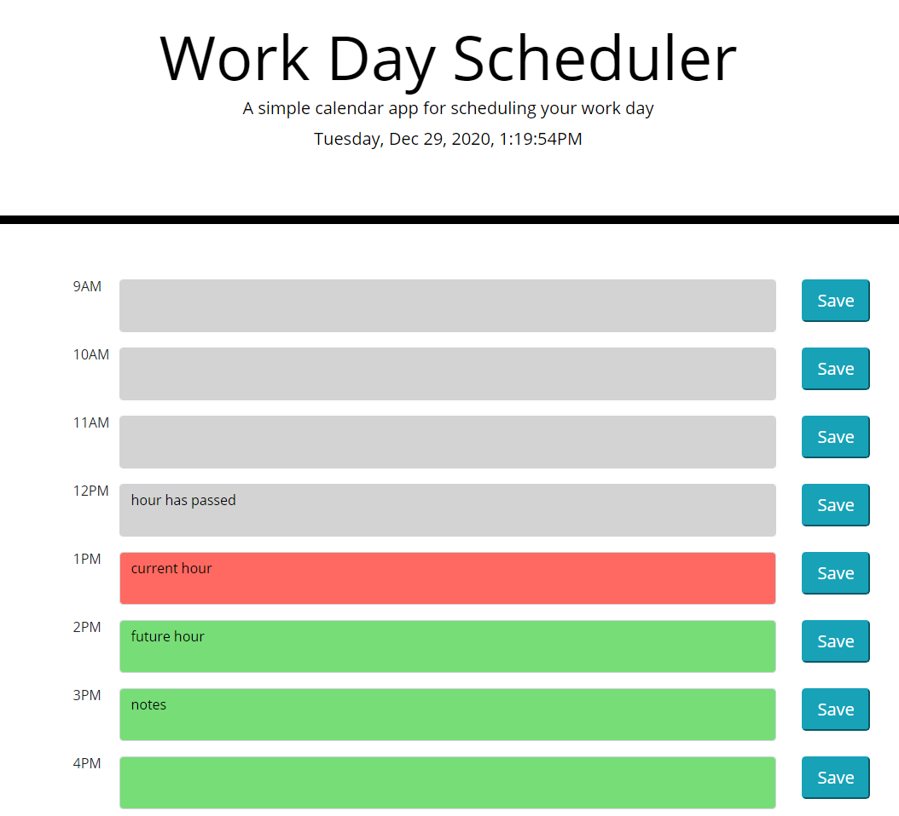

# Work Day Scheduling Project



This site was made to help you organize your day! It has an text box for each hour of the work day. The boxes turn white if the hour is already past, red if its the current hour, and green if it's a hour in the future. The clock is based off local time using moment.js! If you type something in the text box and then press the save button, the text is saved locally!

## Snips of code

Below is a code snippet of the local timer. It displays the hour at the top of the site and updates every second to check if the hour changes. If the hour changes then the color of the text boxes will change accordingly.

```
setInterval( function() {
    time = moment().local().format("dddd, MMM D, YYYY, h:mm:ssA");
    $("#currentTime").text(time)
    checkHour(moment().hour())
}, 1000)
```

The code snippet below shows how the local storage is handled. If the corresponding button is clicked then the text in the text box will be saved to a key, which is note1, and then is retrieved and put back in the text box.

```
$(".btn1").click(function () {
    var message1 = $("#todo1").val()
    window.localStorage.setItem("note1", message1)
    $("#todo1").text(localStorage.getItem("note1"))
})
```

## Built With

* [HTML](https://developer.mozilla.org/en-US/docs/Web/HTML)
* [CSS](https://developer.mozilla.org/en-US/docs/Web/CSS)
* [JS](https://www.javascript.com/)
* [GitHub](https://github.com/)
* [Git](https://git-scm.com/)
* [Bootstrap](https://getbootstrap.com/docs/5.0/getting-started/introduction/)
* [Moment.js](https://momentjs.com/)

## Deployed Link

* [See Live Site](https://pting1995.github.io/work-day-scheduling-project/)

## Authors

* Peter Ting

- [Link to Github](https://github.com/Pting1995)
- [Link to LinkedIn](https://www.linkedin.com/in/pting002/)

## License

This project is licensed under the MIT License 

## Acknowledgments

* Thank you to UC Berkeley's Extension Bootcamp for giving me the opportunity to work on this project!